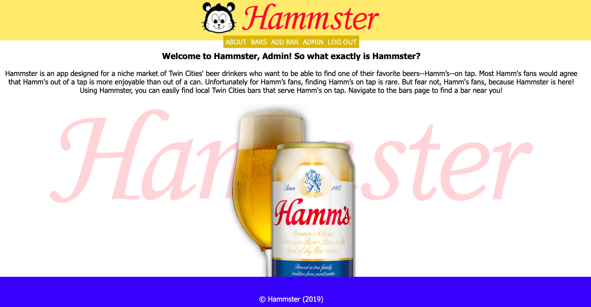

# What is Hammster?

Hi there! Thanks for checking out Hammster. This is an app I developed for my solo project while attending Prime Digital Academy. My friends and I used to always joke about how much we enjoyed Hamm's beer. Over the years this evolved into a genuine love for the product. Whenever one of us would find a bar that had Hamm's on tap we would text the rest of the people in our friend group and let them know. This was always exciting because it was such a rare occurence. For whatever reason, Hamm's is not a popular tap beer. When I was trying to decide what to do for my solo project, I thought that a fun idea could be an app that keeps track of all known Twin Cities' bars that have Hamm's on tap. In addition to that, if someone found a new bar they'd be able to add it to the app. So that is how Hammster, an app that tracks local bars with Hamm's on tap, was born.

View the app here: https://agile-woodland-46778.herokuapp.com
Please note that it may take a minute or so for the app to load.

## Features 
- [x] Display list of known bars
- [x] Each bar has its own message board
- [x] Add bar to app
- [x] Message flagging
- [x] Administrator can approve or deny bars
- [x] Administrator can delete posts
